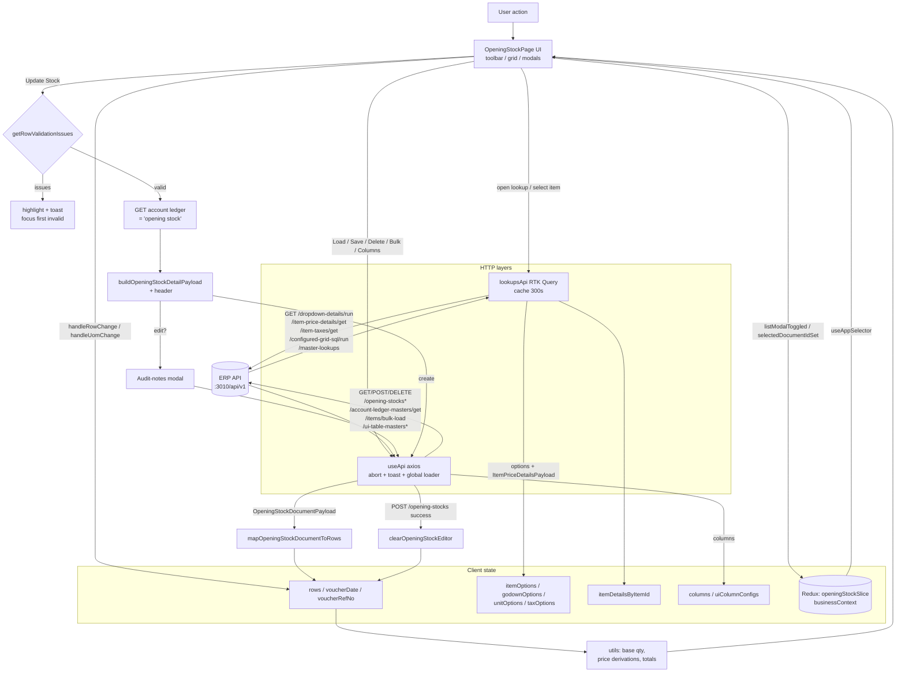

# Opening Stock Page — Technical Documentation

> Source of record: [`features/stocks/opening-stock/page.tsx`](./page.tsx) (`OpeningStockPage`, ~3528 lines) and its full dependency tree.
> This document was produced by reading every imported component, hook, service, type, and util — not the page file alone.

---

## Table of Contents
1. [Page Overview](#1-page-overview)
2. [Component Structure](#2-component-structure)
3. [State Management](#3-state-management)
4. [Workflow (step-by-step)](#4-workflow-step-by-step)
5. [API Calls](#5-api-calls)
6. [Business Logic & Validations](#6-business-logic--validations)
7. [Data Flow Diagram](#7-data-flow-diagram)
8. [Issues & Improvement Suggestions](#8-issues--improvement-suggestions)
9. [Appendix — Dependency Index](#9-appendix--dependency-index)

---

## 1. Page Overview

### Purpose
The **Opening Stock** page is a spreadsheet-style voucher editor for recording the **opening stock balances** of inventory items (per godown/warehouse) at the start of an accounting year. It is the stock-module counterpart to a data-entry grid: each row is one item line carrying quantity, unit, godown, cost/sale prices, tax, cess, and batch/expiry tracking. On save it posts a single **opening-stock voucher** (voucher type id `20`) whose party ledger is the company's `"opening stock"` account ledger.

It supports the full lifecycle:
- **Create** a new opening-stock voucher (blank grid, add rows).
- **Load / Edit** an existing voucher (latest, by ref-no, by voucher-id, or picked from a browse-list modal). Editing requires **audit notes**.
- **Delete** a loaded voucher.
- **Bulk-load** items into rows by master filters (group/brand/section/category/godown).
- Configure the grid **columns** (visibility / focus / necessity / width / order) persisted server-side.

### Where it fits in the stocks module
It lives under `features/stocks/opening-stock/` and shares infrastructure with the sibling **physical-stock** module via `features/stocks/_shared/` (constants, types, `stock-utils.ts`, `LookupCell`, `SelectCell`, and the `stock-page.module.scss` stylesheet). The UI-table-column config endpoints and the `StockListMeta` type are explicitly documented in `_shared/constants.ts` as *"shared by opening-stock and physical-stock"*.

### Route, layout, rendering mode
- **Rendering mode:** **Client Component** — the file begins with `"use client"`. All data is fetched at runtime from the browser; there is no server component / server data fetching in this feature.
- **Layout / route:** `OpeningStockPage` is the **default export** feature component. It is mounted by the Next.js App-Router segment for the stocks/opening-stock path (the `app/**/page.tsx` route re-exports this feature component). It renders inside the app shell that provides `BusinessContextProvider` (company/branch header) and the global loader.
- **Top-level markup:** a `<section class={styles.page}>` containing a header (`Opening Stock` / `Opening Stock (Edit)` title), the `StockToolbar`, a resizable `<table>` inside a scroll viewport, a totals `paginationBar`, plus a set of modals/portals rendered as siblings.

---

## 2. Component Structure

### Component tree (parent → child)

```
OpeningStockPage (default export, "use client")
├── {tableSettingsContextMenu}                → createPortal(document.body)  — "Admin settings" context menu
├── {columnSettingsModal}                     → createPortal(document.body)  — "Table Settings" dialog
└── <section class=page>
    ├── <header> …title…
    └── <div class=tableShell>
        ├── <StockToolbar/>                    — voucher date/ref-no + action buttons
        ├── <div class=tableViewport>
        │   └── <table ref=tableRef>
        │       ├── <colgroup>                 — S.No + configured columns + delete-action col
        │       ├── <thead>                    — draggable + resizable header cells
        │       └── <tbody onContextMenu=…>
        │           └── renderedRows.map → <StockTableRow/>   (one per row)
        │               ├── <SelectCell/>      — for the "uom" column (item-scoped UOM options)
        │               ├── <LookupCell/>      — for kind="lookup" columns (item, godown)
        │               ├── <SelectCell/>      — for kind="select" columns (profittype, roundoff, tracking, cess)
        │               ├── date input group   — for kind="date" columns (batch/mfg/expiry)
        │               └── <input/>           — for text/number columns
        └── <div class=paginationBar>          — qty / free qty / stock value totals
    ├── <ItemMasterPageContent/>               — inline modal (conditional, isInlineItemMasterOpen)
    ├── <GodownMasterPageContent/>             — inline modal (conditional, isInlineGodownMasterOpen)
    ├── <DeleteConfirmModal/>  ×3              — (a) replace-rows load confirm, (b) delete loaded stock, (c) unsaved-changes leave
    ├── <OpeningStockAuditNotesModal/>         — audit notes on edit-save
    ├── <BulkLoadItemsModal/>                  — master-filtered bulk item loader
    └── <OpeningStockListModal/>               — browse/pick saved vouchers
```

### Component reference

| Component | File | Role | Key props received |
|-----------|------|------|--------------------|
| `StockToolbar` | `stock-toolbar.tsx` | Voucher-date + ref-no inputs and the action-button row. Presentational; no internal fetching. | `voucherDate`, `voucherRefNo`, `voucherDatePickerRef`, loading flags (`isLoadingStock`, `isSavingOpeningStock`, `isDeletingOpeningStock`, `isBulkLoadingItems`, `isBusinessContextLoading`), `canDeleteLoadedStock`, `canClearRows`, and callbacks `onVoucherDateChange`, `onVoucherRefNoChange`, `onBrowseStockList`, `onLoadByRefNo`, `onLoadStock`, `onBulkLoadItems`, `onClearRows`, `onUpdateStock`, `onDeleteStock`. |
| `StockTableRow` | `stock-table-row.tsx` | Renders one grid row. Chooses cell control per `column.kind`. Purely presentational — all mutations bubble up through callbacks. | `row`, `rowIndex`, `columns`, `invalidFieldKeys`, `itemDetailsByItemId`, the `*OptionsByValue` maps, `unitDecimalCountById`, `openLookupCell`, `lookupSearchQuery`, `filtered{Item,Godown}Options`, loading flags, refs (`lookupSearchInputRef`, `lookupRootRefs`, `rowDatePickerRefs`), and callbacks `onRemoveRow`, `onRowChange`, `onUomChange`, `onLookupSelection`, `onLookupSearchChange`, `onLookupToggle`, `onLookupCreateShortcut`, `onLookupEditShortcut`. |
| `LookupCell` (shared) | `_shared/LookupCell.tsx` | Searchable dropdown cell (tabular layout with S.No + code + label columns). Handles keyboard nav, `Alt+C`/`Alt+A` shortcuts, docked-menu positioning. | `rowId`, `fieldKey`, `cellKey`, `lookupKind`, `isOpen`, `isLoading`, `selectedId`, `selectedLabel`, `options`, `columns` (`LOOKUP_TABLE_COLUMNS`), `dockMenuToPageBottomRight`, `searchQuery`, `shortcutValues`, `hasValidationError`, refs, and `onToggle`/`onSelect`/`onSearchChange`/`onSearchCreateShortcut`/`onSearchEditShortcut`. |
| `SelectCell` (shared) | `_shared/SelectCell.tsx` | Native `<select>` styled like the grid. Business rules (options, disabled, placeholder) stay in the caller. | `rowId`, `fieldKey`, `value`, `options`, `placeholderOption`, `disabled`, `hasError`, `hideNativeArrow`, `optionKeyPrefix`, `onChange`, `onKeyDown`. |
| `StockToolbar` date group | inline in `stock-toolbar.tsx` | text `dd/mm/yyyy` input + hidden native `<input type=date>` + calendar button. | — |
| `BulkLoadItemsModal` | `BulkLoadItemsModal.tsx` | Modal to bulk-load items filtered by company/branch/godown/group/brand/section/category. Fetches its own master lookups. | `isOpen`, `defaultCompanyId`, `defaultBranchId`, `loading`, `onClose`, `onLoadItems(params: BulkLoadParams)`. |
| `OpeningStockAuditNotesModal` | `opening-stock-audit-notes-modal.tsx` | Textarea for mandatory audit notes when **updating** an existing voucher (max 1000 chars). `Ctrl/Cmd+Enter` confirms, `Escape` cancels. | `isOpen`, `notes`, `error`, `loading`, `voucherLabel`, `onChange`, `onConfirm`, `onCancel`. |
| `OpeningStockListModal` | `opening-stock-list-modal.tsx` | Paginated browse list of saved vouchers with search + date filters. Columns come from grid-config `gridId 16`. Arrow-key navigation + `Enter` to load. | `isOpen`, `suspendKeyboardShortcuts`, `filters`, `rows`, `loading`, `error`, `totalEntries`, `currentPage`, `pageSize`, `selectedVoucherId`, `selectedVoucherLabel`, and callbacks (`onClose`, `onSearchChange`, `onDateFromChange`, `onDateToChange`, `onPageChange`, `onPageSizeChange`, `onSelectRow`, `onLoadRow`, `onLoadSelected`). |
| `DeleteConfirmModal` (shared UI) | `components/ui/delete-confirm-modal.tsx` | Generic confirm dialog. Used 3×. `iconVariant="replace"` swaps the trash icon for a two-way-arrows icon (used for the *replace rows* confirm). `Enter` confirms, `Escape` cancels. | `isOpen`, `title`, `message`, `itemName`, `iconVariant`, `confirmLabel`, `cancelLabel`, `loading`, `loadingLabel`, `onConfirm`, `onCancel`. |
| `ItemMasterPageContent` | `features/masters/inventory/item/item-master-page.tsx` | The full **Item master** page rendered as an inline modal only (`inlineModalOnly`). Used for create/edit item without leaving the grid. | `inlineModalOnly`, `onCrudControllerReady`, `onModalOpenChange`, `onItemSaved({ itemId, shouldUpdate, values })`. |
| `GodownMasterPageContent` | `features/masters/inventory/godown/page.tsx` | The full **Godown master** page rendered as an inline modal only. | `inlineModalOnly`, `onCrudControllerReady`, `onModalOpenChange`, `onGodownSaved({ godownId, shouldUpdate, values })`. |

### Shared / reusable components used
- **Grid cells:** `LookupCell`, `SelectCell` (shared with physical-stock).
- **Modals:** `DeleteConfirmModal` (design-system UI), plus the `dynamic-modal-form.module.scss` overlay/panel classes reused directly for the bulk-load and column-settings dialogs.
- **Inline master pages:** `ItemMasterPageContent`, `GodownMasterPageContent` — driven by a shared `CrudMasterPageController` handle.
- **Business header context:** `useBusinessContext()` (company/branch selection + locking).

### Prop-flow notes
- The page is the **single source of truth**; every child is controlled. `StockTableRow` receives derived read-models (`itemOptionsByValue`, `godownOptionsByValue`, `unitOptionsByValue`, `unitDecimalCountById`, `filtered*Options`) and pushes changes up via `onRowChange` / `onUomChange` / `onLookupSelection`.
- `onLookupCreateShortcut` / `onLookupEditShortcut` are dispatched by the page to open the inline item/godown master modal (`Alt+C` create, `Alt+A` edit).
- The inline master save callbacks (`onItemSaved` / `onGodownSaved`) fire on **both create and update** (distinguished by `shouldUpdate`); the page re-resolves the new option and selects it into the originating row.

---

## 3. State Management

**No `react-hook-form` / no `useReducer`.** The editor is modelled as a controlled array of rows plus many discrete `useState` slices. Row values are a flat `Record<string,string>` (`OpeningStockRow = { id: number; values: Record<string,string> }`), so every cell is a controlled string input and all numeric/date parsing happens in utils.

### 3.1 Local component state (`useState`)

| State | Type | Purpose |
|-------|------|---------|
| `voucherDate` | `string` (dd/mm/yyyy) | Voucher date; initialised to `getTodayInputValue()`. |
| `voucherRefNo` | `string` | Reference no (also a load key). |
| `rows` | `OpeningStockRow[]` | The grid data. Initial `INITIAL_ROWS` (one empty row). |
| `invalidFieldKeys` | `Record<string, true>` | Set of `"rowId:fieldKey"` flagged invalid (drives red highlighting). |
| `uiColumnConfigs` | `UiTableColumnPayload[]` | Server-configured column definitions (visibility/width/position). |
| `tableSettingsContextMenuPosition` | `{left, top} | null` | Right-click "Admin settings" menu position. |
| `isColumnSettingsOpen` / `columnSettingsDraft` / `isColumnSettingsSaving` | `boolean` / `Record<string, {visible,focus,necessity}>` / `boolean` | Column-settings dialog open state, draft edits, and save spinner. |
| `itemDetailsByItemId` | `Record<string, ItemPriceDetailsPayload>` | Cache of full item price/tax detail per item (drives autofill, UOM options, batch rules). |
| `unitDecimalCountById` | `Record<string, number>` | Per-unit allowed decimal places for qty inputs. |
| `itemOptions` / `taxOptions` / `unitOptions` / `godownOptions` | option arrays | Lookup option sources (item/godown are `StockLookupOption[]` with `code`; tax/unit are `ERPDynamicSelectOption[]`). |
| `loadedVoucherId` / `loadedDocumentMeta` | `string | null` / `LoadedOpeningStockMeta | null` | The currently-loaded voucher (edit mode marker) + its company/branch/date/label. |
| `isLoadingStock` | `boolean` | Load-in-progress spinner. |
| `isBulkLoadModalOpen` / `isBulkLoadingItems` | `boolean` | Bulk-load modal + its request state. |
| `pendingLoadRequest` | `OpeningStockLoadRequest | null` | A deferred load (`latest` / `refno` / `voucher`) awaiting the "replace current rows?" confirm. |
| `isDeleteLoadedStockConfirmOpen` | `boolean` | Delete-confirm modal for the loaded voucher. |
| `pendingOpeningStockSaveRequest` | `OpeningStockSaveRequest | null` | Held save payload while the audit-notes modal is open. |
| `openingStockAuditNotes` / `openingStockAuditNotesError` | `string` / `string | null` | Audit-notes textarea + validation error. |
| `isInlineItemMasterOpen` / `inlineItemMasterSession` | `boolean` / `InlineItemMasterRequest | null` | Inline item-master modal open + which row/mode/query triggered it. |
| `isInlineGodownMasterOpen` / `inlineGodownMasterSession` | `boolean` / `InlineGodownMasterRequest | null` | Inline godown-master modal equivalents. |
| `openLookupCell` | `LookupCellState | null` | `{ key: "rowId:fieldKey", kind }` — which lookup dropdown is open. |
| `lookupSearchQuery` | `string` | Text in the open lookup's search box. |
| `columns` | `ColumnDefinition[]` | The rendered columns (resolved schema + live width, reorderable). |
| `isUnsavedChangesConfirmOpen` | `boolean` | "Leave Opening Stock?" navigation-guard modal. |
| `openingStockListFilters` / `openingStockListRows` / `openingStockListMeta` / `openingStockListPage` / `openingStockListPageSize` / `isOpeningStockListLoading` / `openingStockListError` | list-modal state | Browse-list filters, rows, pagination meta, loading, error. |

### 3.2 Redux (global store)

Read via `useAppSelector` and written via `useAppDispatch` (typed hooks from `store/hooks.ts`, `useDispatch.withTypes`/`useSelector.withTypes`):

- **`openingStockSlice`** (`state.openingStock`):
  - `selectOpeningStockIsListModalOpen` → `isOpeningStockListOpen` (drives the browse modal).
  - `selectOpeningStockSelectedDocId` → `selectedOpeningStockListVoucherId` (highlighted/selected row).
  - Dispatched actions: `listModalToggled(boolean)`, `selectedDocumentIdSet(string | null)`.
  - *(The slice also holds `rows`, `validationIssues`, `isDirty`, `columnWidths`, `saveLoading`, etc., but this page keeps the editor state locally and only uses the two modal-related fields.)*

### 3.3 Business context (`useBusinessContext()`)
Provides `activeCompany` (`{ id, compId, name }`), `activeBranch` (`{ id, brId, name }`), `setCompanySelectionLocked`, `setBranchSelectionLocked`, and `loading` (as `isBusinessContextLoading`). The page **locks** company & branch selection whenever any row has a selected godown (see §6), and unlocks on cleanup.
> Note: `activeCompany` has **no** financial-year fields; the accounting year is derived client-side from `voucherDate` (`formatAccountingYear`).

### 3.4 RTK Query lazy hooks (`store/api/lookupsApi`)
```ts
const [triggerItemOptions,     { isFetching: isItemLookupLoading }] = useLazyGetItemOptionsQuery();
const [triggerTaxOptions]      = useLazyGetTaxOptionsQuery();
const [triggerUnitOptions]     = useLazyGetUnitOptionsQuery();
const [triggerItemPriceDetails]= useLazyGetItemPriceDetailsQuery();
const [triggerItemTaxById]     = useLazyGetItemTaxByIdQuery();
```
These give client-side caching (`keepUnusedDataFor: 300s`), invoked imperatively via `.unwrap()`.

### 3.5 `useApi` (axios) instances
Ten `useApi` hooks are created (one per endpoint), e.g. `listUiTableColumns` (getAll), `saveUiTableColumn` (POST), `listAccountLedgers`, `getBulkItems`, `listGodowns`, `listUnits`, `listOpeningStocks`, `listOpeningStockRecords`, `getOpeningStockDocument`, `getOpeningStockDocumentByRefNo`, `saveOpeningStock`, `deleteOpeningStock`. Each exposes `run`/`getAll` + `loading`; several expose `loading` used for button state (`isSavingOpeningStock`, `isDeletingOpeningStock`, `isGodownLookupLoading`).

### 3.6 Refs (`useRef`) — non-render state
Extensive. Categories:
- **DOM refs:** `tableRef`, `lookupRootRefs`, `lookupSearchInputRef`, `voucherDatePickerRef`, `rowDatePickerRefs`.
- **Mirror refs** (avoid stale closures in event handlers): `columnsRef`, `uiColumnConfigsRef`, `hasUnsavedChangesRef`.
- **Request-race guards** (monotonic counters compared to ignore stale async results): `itemSearchRequestRef`, `itemDetailRequestRef` (per-row), `taxDetailRequestRef` (per-row), `godownSearchRequestRef`, `openingStockListRequestRef`.
- **Debounce timers:** `itemSearchTimeoutRef`, `godownSearchTimeoutRef`.
- **Inline-master plumbing:** `inlineItemMasterControllerRef`, `pendingInlineItemMasterRequestRef`, `inlineGodownMasterControllerRef`, `pendingInlineGodownMasterRequestRef`.
- **Drag/resize:** `draggingColumnKeyRef`, `resizingColumnRef`.
- **Navigation guard:** `pendingUnsafeNavigationRef`, `allowUnsafeNavigationRef`, `allowUnsafeNavigationTimeoutRef`.
- **Serialised writes:** `columnWidthSaveQueueRef` (a `Promise` chain that serialises width-save POSTs).
- **Dirty baseline:** `cleanEditorSignatureRef` (JSON signature of the last "clean" editor state).

### 3.7 Derived state & memoisation (`useMemo` / `useCallback`)

**`useMemo`:**
- `unitOptionsByValue`, `taxOptionsByValue`, `itemOptionsByValue`, `godownOptionsByValue` — `Map<value,label>` lookups.
- `filteredItemOptions`, `filteredGodownOptions` — `filterLookupOptions(options, lookupSearchQuery)`.
- `resolvedColumns` — `resolveConfiguredColumns(uiColumnConfigs)` (visible + sorted + schema-mapped).
- `areConfiguredColumnsAllHidden` — if all configured columns are hidden ⇒ `renderedRows = []`.
- `columnSettingsRows` — rows for the settings dialog.
- `editorSignature` — dirty-check signature; `hasUnsavedChanges = editorSignature !== cleanEditorSignatureRef.current`.
- `draftRows` = `rows.filter(!isPristineRow)`; `draftTotals = getTotals(draftRows)`; `visibleTotals = getTotals(renderedRows)`.
- `selectedOpeningStockListRow`, `hasSelectedGodown`, `tableMinWidth`.

**`useCallback`:** essentially every handler (`handleRowChange`, `handleUomChange`, `handleLookupSelection`, `getNextRowValuesWithDerivedPrices`, load/save/delete handlers, column drag/resize/persist handlers, list handlers, inline-master handlers, navigation-guard handlers). This is necessary because `StockTableRow` is passed many callbacks per row.

---

## 4. Workflow (step-by-step)

### 4.1 Page load → initial data fetch → grid populate
1. **Mount.** State initialises (`INITIAL_ROWS` = one pristine row, `voucherDate = today`).
2. **UI column config** (`useEffect` on `listUiTableColumns`): `GET /ui-table-masters/get?uiTableId=5` → find table `uiTblId === "5"` → keep `columns` where `uiTblClmIsActive !== false` → `setUiColumnConfigs`. On failure ⇒ empty (falls back to defaults).
3. **Lookup bootstrap** (`useEffect`, `Promise.allSettled`):
   - `loadLookupOptions("item")` → `triggerItemOptions()` (RTK) → `itemOptions`.
   - `loadTaxOptions()` → `triggerTaxOptions()` → `taxOptions`.
   - `loadUnitOptions()` → `triggerUnitOptions()` → `unitOptions`.
   - `listUnits({ query: UNIT_LIST_QUERY })` → `GET /configured-grid-sql/run?grid_id=4` → `buildUnitDecimalCountById` → `unitDecimalCountById`.
   - `loadLookupOptions("godown")` → `listGodowns` (`GET /configured-grid-sql/run?grid_id=9`) → `buildGodownLookupOptions(payload, activeBranchId)` → `godownOptions`.
   Each result is applied independently (settled), so one failing lookup does not block the others.
4. **Column resolution:** `resolvedColumns` (from `uiColumnConfigs`) → `mergeResolvedColumns` preserves any live widths → `setColumns`. If `uiColumnConfigs` is empty, `columns` stays `[]` until config arrives (defaults are only used inside the settings dialog via `buildOpeningStockColumnSettingsRows` fallback).
5. **Grid renders** one empty row with the configured columns; totals footer shows zeros.

### 4.2 Item selection → autofill → trailing row
1. User opens the item `LookupCell` (click or focus). `openLookupCell` set; the search input auto-focuses (rAF).
2. **Search** (`onLookupSearchChange`): debounced `LOOKUP_SEARCH_DEBOUNCE_MS = 250ms`; a monotonic `itemSearchRequestRef` guards races; results merged via `mergeLookupOptions`.
3. **Select** (`handleLookupSelection(rowId, "item", option)`):
   - Immediately writes `buildPendingItemSelectionValues(option)` (item id + name, reset other autofill fields), then `ensureTrailingEmptyRow` — if the selected row was the last non-pristine row, a new empty row is appended.
   - Clears the `itemname` + tracking-field invalid flags.
   - A per-row `itemDetailRequestRef` id is bumped.
   - **If cached** (`itemDetailsByItemId[value]`): apply `buildItemAutofillValues(...)` synchronously; if the cached detail has no `item_tax` but has a default tax id, fetch `triggerItemTaxById` and merge `buildTaxSelectionValues` (with price re-derivation).
   - **If not cached:** `triggerItemPriceDetails({ itemId })` → store in `itemDetailsByItemId` → apply `buildItemAutofillValues` → optional default-tax fetch. Stale results (row changed / superseded request) are ignored via the ref guard. On error ⇒ `toast.error` (deduped by `toastId`).
4. **Autofill** populates: barcode, code, uom (+`oslunitid`, `oslbaseuomid`), godown, convfactor (+`oslactualconvfactor`), cost price/cost-wot, all four sale-price triplets (wot/markup/sale), mrp/msp, profit type, round off, tax name/id/perc, cess type/perc/per-unit, tracking type (`resolveTrackingType`), remarks.

### 4.3 Editing a cell → derivations → validation clear
`handleRowChange(rowId, field, value)` (the core reducer-like updater):
- Writes the raw field, then applies field-specific logic in one immutable `setRows`:
  - **`osltaxid`** cleared/updated tax name & reset cess fields; then async `triggerItemTaxById` merges `buildTaxSelectionValues` + re-derives prices (race-guarded per row).
  - **Sale/cost/profit/roundoff/tax fields** ⇒ `getNextRowValuesWithDerivedPrices` recomputes cost-wot ↔ cost and the affected sale-price pairs.
  - **`openingqty` / `freeqty` / `convfactor`** ⇒ recompute `baseqty` / `freebaseqty = qty × actualConvFactor`.
  - **`osltrackingtype`** ⇒ clears batch/serial/date fields not applicable to the new tracking type; clears tracking invalid flags.
- After state write, non-empty values clear their `invalidFieldKeys` entry.
- **UOM change** is separate (`handleUomChange`): resolves the item price record for the chosen unit and re-applies `buildPriceSelectionValues` (updates uom label, godown, conv factor, prices).
- **Quantity typing** is normalised in the row component itself via `normalizeOpeningStockQuantityInputValue(value, decimalCount)` (per-unit decimals; blocks `.` when 0 decimals).

### 4.4 Bulk load
1. Toolbar → **Bulk Load Items** → `setIsBulkLoadModalOpen(true)`.
2. `BulkLoadItemsModal` loads its own master lookups (branches/groups/brands/sections/categories/godowns via `/master-lookups/name-id/all-accounts-and-masters`), defaulting company/branch from the page.
3. On submit → `onLoadItems(params)` → `handleBulkLoadItems`:
   - Requires `companyId`. Builds query (`item_company_id`, optional branch/godown/group/brand/section/category, `limit: "500"`).
   - `getBulkItems` → `GET /items/bulk-load` → maps each item to a full row via `createRow(...)` (copies prices, tax, tracking type, conv factor, etc.), appends one trailing empty row.
   - Merges loaded item/godown/unit options; toasts count; **prefetches** full `triggerItemPriceDetails` for each unique item id in the background (populates `itemDetailsByItemId` for UOM-change support).

### 4.5 Loading / edit mode
Three entry points, all guarded by `draftRows.length > 0` ⇒ defer via `pendingLoadRequest` + the **"Replace current rows?"** `DeleteConfirmModal` (`iconVariant="replace"`):
- **Load Latest** (`handleLoadStock` → `loadLatestOpeningStock`): `resolveLoadContext()` validates company/branch/accounting-year → `GET /opening-stocks/list` (page 1, limit 1, scoped by company/branch/acc-year) → take first header → `GET /opening-stocks/get?avh_voucher_id=…`.
- **Load Ref No** (`handleLoadByRefNo` → `loadOpeningStockByRefNo`): requires ref-no → `GET /opening-stocks/list?avh_voucher_refno=…` scoped by company/branch/acc-year.
- **Browse list** (`OpeningStockListModal`): pick a row → `handleLoadOpeningStockListRow` → `loadOpeningStockByVoucherId` → `GET /opening-stocks/get`.

On success → `applyLoadedOpeningStockDocument(document)`:
- `mapOpeningStockDocumentToRows` builds rows from `document.details` (+ trailing empty row).
- Merges item/godown/unit/tax options from the detail labels.
- Sets voucher date/ref-no, `loadedVoucherId`, `loadedDocumentMeta`.
- `markEditorStateAsClean(...)` resets the dirty baseline so a freshly-loaded voucher is not "dirty".
- Background `prefetchLoadedItemDetails(document.details)` fetches price details for all item ids.
- Title switches to **"Opening Stock (Edit)"** when `loadedVoucherId && draftRows.length > 0`.

### 4.6 Save / update → validation → API → success
`handleUpdateStock`:
1. **Guards:** active company, active branch, valid accounting year, valid `voucherDate` (`toIsoDateTime`), a resolved `userId` (`getAuthUserId`), and at least one `draftRow`.
2. **Row validation:** `draftRows.flatMap(getRowValidationIssues(...))`. If any: set `invalidFieldKeys`, focus + scroll to the first invalid field (`focusOpeningStockField` via rAF), and toast a summary (`renderValidationToastContent`, first 5 issues + "+N more"). Abort.
3. **Ledger resolution:** `GET /account-ledger-masters/get?ledCompanyId=…&ledIsActive=true&page=1&limit=100` → `extractRows` → filter ledgers named exactly `"opening stock"` (case-insensitive). Zero ⇒ error toast; more than one ⇒ ambiguity error. Exactly one ⇒ use its `ledId` as `avh_party_id`.
4. **Build payload** `OpeningStockSaveRequest`:
   - `header`: `avh_voucher_id` (only when editing), `avh_voucher_type_id: 20`, `osh_acc_year`, company/branch, `osh_voucher_date` (ISO), `avh_party_id` (ledger), `avh_bill_date`, session/device (`getAuthSessionId`, `getOrCreateClientDeviceId`), `osh_device_type: "WEB"`, `osh_counter_id: "COUNTER-1"`, `osh_status: "DRAFT"`, narration (`buildOpeningStockNarration` = joined remarks), totals from `draftTotals`, `osh_user_id`.
   - `details`: `draftRows.map(buildOpeningStockDetailPayload)` (parses every string to number/null, maps tracking type to `NONE/MRP/BATCH`, dates to ISO).
5. **Edit path:** if `loadedVoucherId` present, hold the payload in `pendingOpeningStockSaveRequest` and open the **audit-notes modal**; confirm requires non-empty notes → `submitOpeningStockSave(payload, notes)`.
   **Create path:** `submitOpeningStockSave(payload)` directly.
6. `submitOpeningStockSave` → `POST /opening-stocks` (via `saveOpeningStock`, success toast `"Opening stock updated successfully."`). On success → `clearOpeningStockEditor()` (reset to one empty row, clear loaded state, mark clean). Errors handled by `useApi` toast.

### 4.7 Delete flow
`handleDeleteLoadedStock` (enabled only when `loadedVoucherId`) → open delete-confirm modal → `handleConfirmDeleteLoadedStock` → `DELETE /opening-stocks/delete?avh_voucher_id=…` (`deleteOpeningStock`, success toast) → `clearOpeningStockEditor()`.

### 4.8 Column configuration
- **Right-click** the table body → `handleTableBodyContextMenu` opens the "Admin settings" context-menu portal (position clamped to viewport).
- **Admin settings** → `openColumnSettings` builds `columnSettingsDraft` from `columnSettingsRows` and opens the Table Settings dialog (portal).
- Toggle **Visible / Focus / Necessity** per column → **Save** → `saveColumnSettings` → `POST /ui-table-masters/create` with the full column set → re-fetch `GET /ui-table-masters/get` → refresh `uiColumnConfigs`. `F5` saves, `Escape` closes.
- **Drag** header cells to reorder (`reorderColumns`); **drag the resize handle** to resize — on mouse-up, if width changed, `enqueueOpeningStockColumnWidthSave` serialises a `POST /ui-table-masters/create` with just that column's new width (queued via `columnWidthSaveQueueRef`).

### 4.9 Keyboard shortcuts
| Keys | Context | Action |
|------|---------|--------|
| `Enter` | any grid cell | Move focus to next focusable cell (`moveOpeningStockFieldFocus`). |
| `Escape` | open lookup / context menu / settings / modals | Close the lookup / menu / modal. |
| `F5` | page | Open the browse-list modal, or refresh it if already open. |
| `F5` | column-settings dialog | Save column settings. |
| `Alt+C` | focused row control **or** open item/godown lookup | Open inline **create** master (item or godown) seeded with the typed query. |
| `Alt+A` | focused row control **or** open lookup | Open inline **edit** master for the row's selected item/godown. |
| `Ctrl/Cmd+Enter` | audit-notes modal | Confirm save. |
| `↑ / ↓` | browse-list modal | Move row selection. |
| `Enter` | browse-list modal | Load the selected voucher. |
| `Enter` | ref-no toolbar input | Trigger Load Ref No. |

### 4.10 Unsaved-changes navigation guard
Three layers, all gated on `hasUnsavedChangesRef.current && !allowUnsafeNavigationRef.current`:
1. **`beforeunload`** — native browser prompt.
2. **Patched `router.push/replace/back/forward`** — intercept Next.js navigations; if dirty, open the "Leave Opening Stock?" modal and only proceed on confirm (which sets a 10s bypass window).
3. **Document-level click capture** — intercept plain left-clicks on same-tab anchors; same-origin ⇒ `router.push`, cross-origin ⇒ `window.location.assign`, both after `notifyGlobalNavigationStart()`.

---

## 5. API Calls

Two HTTP layers share the same base (`…:3010/api/v1`, overridable via `NEXT_PUBLIC_API_BASE`) and the same 401-refresh-retry pattern (implemented independently):
- **`useApi`** — axios; imperative; per-call abort (a new call cancels the in-flight previous one via `AbortController`); toasts + global loader (`globalLoaderStarted/Finished`); auto `Authorization: Bearer` from `getAuthSession()`.
- **`lookupsApi`** (RTK Query over `fetchBaseQuery`) — declarative caching (`keepUnusedDataFor: 300s`; only `getItemOptions` declares `providesTags: ItemLookup`).

### 5.1 `useApi` (axios) endpoints

| # | Endpoint | Method | Triggered when | Request (query / body) | Response consumed | Loading / errors |
|---|----------|--------|----------------|------------------------|-------------------|------------------|
| 1 | `/ui-table-masters/get` | GET | On mount + after saving column settings | `{ uiTableId: "5" }` | `ApiSuccessResponse<UiTableMasterResponse[]>` → find `uiTblId==="5"` → active columns → `uiColumnConfigs` | Toasts off. Failure ⇒ empty configs. |
| 2 | `/ui-table-masters/create` | POST | Save column settings; per-column width persist | body `SaveOpeningStockUiTableMasterRequest` `{ uiTblId:"5", uiTblColumns:[…] }` | `{ columns: UiTableColumnPayload[] }` → upsert into `uiColumnConfigs` | Toasts off. Width saves serialised via a promise queue. |
| 3 | `/account-ledger-masters/get` | GET | During `handleUpdateStock` (save) | `{ ledCompanyId, ledIsActive:"true", page:"1", limit:"100" }` | `extractRows<AccountLedgerRecord>` → filter name `"opening stock"` | Toasts off; explicit error/ambiguity toasts in page. |
| 4 | `/items/bulk-load` | GET | Bulk-load submit | `{ item_company_id, limit:"500", [item_branch_id], [godown_id], [item_group_id], [item_brand_id], [item_section_id], [item_category_id] }` | `OpeningStockSuccessResponse<BulkOpeningStockItemPayload[]>` → rows | Toasts off; page toasts empty/success/error. `isBulkLoadingItems`. |
| 5 | `/configured-grid-sql/run?grid_id=9` | GET | Godown lookup (bootstrap + search) | `GODOWN_GRID_LIST_QUERY` `{ page:"1", limit:"100", grid_param:'{"wantdelete":false}' }` (+ `search`) | `buildGodownLookupOptions(payload, branchId)` (branch-filtered) → `godownOptions` | Toasts off. `isGodownLookupLoading`. |
| 6 | `/configured-grid-sql/run?grid_id=4` | GET | On mount | `UNIT_LIST_QUERY` `{ page:"1", limit:"100" }` | `buildUnitDecimalCountById` → `unitDecimalCountById` | Toasts off. |
| 7 | `/opening-stocks/list` | GET | Browse list; load-latest; load-by-refno | list: `{ page, limit, [search], [date_from], [date_to] }`; latest: `{ osh_company_id, osh_branch_id, osh_acc_year, page:"1", limit:"1" }`; refno: `{ avh_voucher_refno, osh_company_id, osh_branch_id, osh_acc_year }` | `OpeningStockSuccessResponse<OpeningStockHeaderPayload[], OpeningStockListMeta>` | `isOpeningStockListLoading`; abort-aware; race-guarded (`openingStockListRequestRef`). |
| 8 | `/opening-stocks/get` | GET | Load a specific voucher (list/latest) | `{ avh_voucher_id }` | `OpeningStockSuccessResponse<OpeningStockDocumentPayload>` → `applyLoadedOpeningStockDocument` | `isLoadingStock`; toasts off (page toasts empty). |
| 9 | `/opening-stocks` | POST | Save/update | body `OpeningStockSaveRequest` (`+ audit_notes` on edit) | success only | `isSavingOpeningStock`; success toast `"Opening stock updated successfully."` |
| 10 | `/opening-stocks/delete` | DELETE | Confirm delete loaded voucher | `{ avh_voucher_id }` | success only | `isDeletingOpeningStock`; success toast `"Opening stock deleted successfully."` |

> Note: `listOpeningStocks` (error-toast on) and `listOpeningStockRecords` (error-toast off, used by the browse modal) are two separate `useApi` instances of the **same** `/opening-stocks/list` endpoint; `getOpeningStockDocument` and `getOpeningStockDocumentByRefNo` are two instances of `/opening-stocks/get` and `/opening-stocks/list` respectively.

### 5.2 `lookupsApi` (RTK Query) endpoints — all **GET**

| Hook | URL | Query args | `.unwrap()` returns | Trigger |
|------|-----|-----------|---------------------|---------|
| `useLazyGetItemOptionsQuery` | `/dropdown-details/run` | `{ dropdown_id:"6", page:"1", limit:"20", dropdown_param:'{"branch_id":1,"company_id":2}' }` (+ `search`) | `StockLookupOption[]` `{value,label,code?}` (deduped, sorted, leading empty option) | Mount bootstrap; debounced item search; after inline item-master save. Cached & tagged `ItemLookup` by search. |
| `useLazyGetItemPriceDetailsQuery` | `/item-price-details/get` | `{ item_id }` | `ItemPriceDetailsPayload` (`item`, `item_prices[]`, `item_tax`) | On item select (uncached); load prefetch; bulk-load prefetch. |
| `useLazyGetItemTaxByIdQuery` | `/item-taxes/get` | `{ tax_id }` | `ItemTaxDetailPayload` `{tax_id, tax_name, tax_gst_rate_total, tax_cess_type, tax_cess_perc, tax_cess_unit}` | On tax change; when item detail lacks `item_tax` but has default tax id. |
| `useLazyGetTaxOptionsQuery` | `/configured-grid-sql/run` | `{ grid_id:"5" }` | `ERPDynamicSelectOption[]` (leading `{value:"",label:"None"}`) | Mount bootstrap. |
| `useLazyGetUnitOptionsQuery` | `/master-lookups/name-id/all-accounts-and-masters` | `{ module:"units", limit:"100" }` (+ `search`) | `ERPDynamicSelectOption[]` | Mount bootstrap; unit label refresh. |

### 5.3 Modal-owned calls
- **`BulkLoadItemsModal`** — six parallel `GET /master-lookups/name-id/all-accounts-and-masters` calls with `module` = `branches`, `itemGroups`, `itemBrands`, `itemSections`, `itemCategories`, `godownLocations` (each `limit:"100"`), fired on open. Godowns are branch-filtered client-side. Toasts off; defaults kept on error.
- **`OpeningStockListModal`** — `useGetGridColumnsQuery({ gridId: 16 })` (from `store/api/metadataApi`, skipped unless open) to resolve which list columns to show; falls back to `DEFAULT_OPENING_STOCK_LIST_COLUMNS`.

### 5.4 Caching / invalidation
- RTK Query: time-based cache (300s) for all five lookups; `ItemLookup` tag on item options. Per-module lookup caches are invalidated elsewhere (masters saga on save) via `baseApi.util.invalidateTags`.
- `useApi`: no client cache — each `run` hits the network; a new call aborts the previous in-flight one.
- Item detail cache is **manual** in component state (`itemDetailsByItemId`), reused across selection/UOM-change without refetch.

---

## 6. Business Logic & Validations

### 6.1 Client-side validation (`getRowValidationIssues`, per draft row)
Order and rules (each yields `{ fieldKey, message }`):
1. **Item required** — `oslitemid` non-empty (else field `itemname`).
2. **Unit required** — `oslunitid` (field `uom`).
3. **Godown required** — `oslgodownid` (field `godown`).
4. **Opening qty required** — `openingqty` non-empty.
5. **Non-negative numbers** — every `kind:"number"` column (`OPENING_STOCK_NON_NEGATIVE_NUMBER_FIELD_KEYS`): if present, must parse to a finite `>= 0` number.
6. **Date format** — `batchdate`, `mfgdate`, `expirydate` must be valid `dd/mm/yyyy` (`toCanonicalDateValue`).
7. **Expiry ≥ Mfg** — if both present, `expirydate >= mfgdate`.
8. **Tracking-required fields** — via `getTrackingRequiredFieldKeys(row, itemDetail)`:
   - Tracking `"1"` (MRP) requires `mrp`.
   - Tracking `"2"` (BATCH) requires `batchno, serialno, mfgdate, batchdate, expirydate` — **`batchno` is dropped** from the requirement unless the item is `item_is_batch_based`.

Validation is **only** run on save (`handleUpdateStock`). Invalid fields are highlighted (`invalidFieldKeys` → `styles.requiredField`), and cleared incrementally as the user satisfies them (effect on `[invalidFieldKeys, rows]` + `isValidationFieldSatisfied`). Batch/tracking validity also drives live "required" styling in the row (`isTrackingRequiredFieldMissing`).

### 6.2 Calculations (`opening-stock.utils.ts`)
- **Base quantities:** `baseqty = openingqty × actualConvFactor`, `freebaseqty = freeqty × actualConvFactor`, where `actualConvFactor = oslactualconvfactor || convfactor || 1` (`getOpeningStockActualConvFactor`). Formatted with 3 decimals, commas stripped.
- **Tax-exclusive ↔ inclusive:**
  - `costwot = costprice / (1 + taxPerc/100)` (`getOpeningStockCostWotInputValue`), and inverse `costprice = costwot × (1 + taxPerc/100)`.
  - Same relation applies to each sale price's `*wot` vs inclusive value.
- **Sale-price triplets** (`OPENING_STOCK_SALE_PRICE_FIELD_PAIRS` = A/B/C/D, each `{sale, saleWot, markup}`), derived by `getOpeningStockSalePairDerivedValues(values, pair, source)`:
  - `source="markup"`: `sale = cost + markup` (BY_AMOUNT) or `cost + cost×markup/100` (BY_PERCENT), then rounded by `roundoff`, then `saleWot` recomputed. Skipped when profit type is `MANUAL`.
  - `source="saleWot"`: recompute inclusive `sale` from `saleWot`, then recompute `markup`.
  - default (`sale`): recompute `saleWot` + `markup` from the inclusive sale.
- **Markup %** (`getOpeningStockMarkupInputValue`): BY_AMOUNT ⇒ `sale − cost`; else `((sale − cost)/cost)×100` when cost>0.
- **Round-off** (`roundDerivedOpeningStockValue`): snaps a derived value to the nearest `roundoff` step (`ROUND_OFF_OPTIONS`).
- **Quantity decimals** (`normalizeOpeningStockQuantityInputValue`): clamps `openingqty`/`freeqty` fraction length to the unit's `unit_decimal_count`; blocks the decimal point when 0 decimals; re-derives base qty on unit-driven normalisation (`normalizeOpeningStockRowQuantitiesByUnit`).
- **Totals** (`getTotals`): `qty = Σ openingqty`, `freeQty = Σ freeqty`, `value = Σ (openingqty × costprice)` (`getRowStockValue`), `lines = count`. `draftTotals` (non-pristine rows) feed the save payload; `visibleTotals` feed the footer.

### 6.3 Tracking / profit / cess normalisation
- **Tracking type** (`normalizeOpeningStockTrackingType`): `0=NONE`, `1=MRP`, `2=BATCH` (accepts numeric or label). `resolveTrackingType(item)` derives it from `item_batch_config` / `item_is_batch_based` / `item_is_expiry_item`. Persisted as label (`toOpeningStockTrackingTypePayloadValue`).
- **Profit type** (`normalizeOpeningStockProfitType`): `BY_PERCENT` / `BY_AMOUNT` / `MANUAL` (with legacy aliases).
- **Cess type** (`normalizeOpeningStockCessType`): `NONE` / `PERCENT` / `PER_UNIT`.
- **Field disable/hide rules** (`isOpeningStockFieldDisabled`, `isOpeningStockFieldHidden`): id/derived fields (base qty, conv factor, tax perc, cess, hidden ids) are always disabled; batch-only fields disabled unless tracking is BATCH; batch no editable only when item is batch-based and tracking ≠ NONE; price/markup/mrp/msp disabled under NONE tracking; markup fields disabled under MANUAL profit; `profittype`/`roundoff` hidden under NONE tracking.

### 6.4 Company / branch scoping & ERP conventions
- **Selection locking:** whenever any row has a godown (`hasSelectedGodown`), the page calls `setCompanySelectionLocked(true)` / `setBranchSelectionLocked(true)` so the header cannot switch context mid-edit; unlocked on cleanup.
- **Loaded-doc context invalidation:** if the active company/branch changes away from the loaded voucher's `companyId`/`branchId`, `loadedVoucherId`/`loadedDocumentMeta` are cleared (the loaded voucher no longer belongs to the current context).
- **Accounting year:** `formatAccountingYear(voucherDate)` derives an Apr–Mar financial year string `"YYYY-YYYY+1"` client-side; required before load/save.
- **Godown branch filtering:** `buildGodownLookupOptions` drops godowns whose branch id ≠ active branch.
- **Voucher identity:** `avh_voucher_type_id: 20`, party ledger = the company's `"opening stock"` account ledger (must be exactly one active match), status `"DRAFT"`, device `"WEB"`, counter `"COUNTER-1"`, session/device ids from `@/lib/auth/session`.
- **Audit trail:** updating an existing voucher requires non-empty `audit_notes` (≤1000 chars), sent in the save body.
- **Soft-delete:** godown grid 9 is bound with `grid_param {"wantdelete":false}`; the browse list reads `osh_is_active`/`osh_is_deleted` in the header payload; deletion is a `DELETE` endpoint (server-side soft delete).

---

## 7. Data Flow Diagram



---

## 8. Issues & Improvement Suggestions

**Architecture / maintainability**
- **God component.** `page.tsx` is ~3528 lines with ~40 `useState`, ~25 refs, and dozens of effects/callbacks. The unfinished `use-opening-stock.ts` hook is an explicit acknowledgement (*"composes its state and effects directly in page.tsx"*). Extracting cohesive hooks (`useOpeningStockEditor`, `useOpeningStockLookups`, `useColumnConfig`, `useNavigationGuard`) would dramatically improve testability. Sibling `_shared/useLookupState.ts`, `_shared/useColumnConfig.ts`, `_shared/useStockLookups.ts` exist and appear intended for exactly this.
- **Duplicated utilities.** `opening-stock.utils.ts` and `_shared/stock-utils.ts` both define `cx`, `parseDecimal`, `toInputValue`, `formatDateForDisplay`, `toCanonicalDateValue`, `buildGodownLookupOptions`, `buildUomOptions`, `resolveItemPriceRecordByUnitId`, `mergeLookupOptions`, etc. The opening-stock copies diverge slightly (e.g. `StockLookupOption` with `code`). Consolidating on the shared module (parametrised) would remove drift risk.
- **Two HTTP stacks.** `useApi` (axios) and `lookupsApi` (RTK Query) each re-implement API-base resolution and 401-refresh-retry. This is duplicated auth logic that can subtly diverge; consider standardising on RTK Query (or a single axios client) for all reads.

**Correctness / robustness**
- **Router monkey-patching.** The navigation guard reassigns `router.push/replace/back/forward` on the `useRouter()` instance. This is fragile against Next.js internals and other consumers of the same router object; a `useBeforeUnload` + link-interception approach (already partly present) or the App Router's intended patterns would be safer.
- **Effect depending on `rows` that calls `setRows`.** The unit-decimal normalisation effect lists `rows` in its deps and calls `setRows`; it is guarded by change-detection (returns the same array when nothing changes) so it converges, but it re-runs on **every** row edit and is easy to break into an infinite loop if the guard is weakened. Prefer normalising inside `handleRowChange`/`handleUomChange` instead of a reactive effect.
- **Hardcoded limits.** `getBulkItems` caps at `limit:"500"`; the ledger lookup uses `limit:"100"`; item lookup page size is `20`. A company with >100 ledgers or >500 filtered items could silently miss data. Consider server-side exact-match for the ledger (`ledName=opening stock`) instead of client-side filtering a capped page.
- **Hardcoded `osh_counter_id: "COUNTER-1"`** and `dropdown_param:'{"branch_id":1,"company_id":2}'` (item options) look like placeholders not derived from the active company/branch — verify these are intentional for opening stock.
- **`serialno` column `defaultWidth: "12px"`** in `COLUMN_SCHEMA` is almost certainly a typo (all sibling columns are ~100–120px); it will render an unusably narrow column when configured.
- **`BulkLoadItemsModal` keydown effect has no dependency array** (runs every render, re-registering the listener) and references `handleSubmit` before its declaration via hoisting — works, but brittle; give it a proper deps array.

**Performance**
- Each `StockTableRow` receives many props including large `Map`s and option arrays; `StockTableRow` is **not** memoised (`React.memo`), so editing one cell re-renders every row. For large bulk-loaded grids (up to 500 rows) this is the most likely perf hotspot — memoise the row and pass per-row-stable props.
- `filterLookupOptions` / `mergeLookupOptions` sort on every keystroke; fine for typical sizes but scales O(n log n) per debounce.

**UX / accessibility**
- The unsaved-changes guard mutating global Redux lock state means a crash before cleanup could leave company/branch permanently locked; a safety unlock on error boundary would help.
- Numeric inputs use `onWheel → blur` to prevent scroll-changing values (good), and `ArrowUp/Down` are suppressed — but this also disables legitimate keyboard incrementing; acceptable trade-off, worth noting.

---

## 9. Appendix — Dependency Index

**Local (this folder)**
- `page.tsx` — `OpeningStockPage` (root).
- `stock-toolbar.tsx` — `StockToolbar`.
- `stock-table-row.tsx` — `StockTableRow`.
- `BulkLoadItemsModal.tsx` — `BulkLoadItemsModal`, `BulkLoadParams`.
- `opening-stock-audit-notes-modal.tsx` — `OpeningStockAuditNotesModal`.
- `opening-stock-list-modal.tsx` — `OpeningStockListModal`.
- `constants.ts` — endpoints, `COLUMN_SCHEMA`, tracking/profit/cess/round-off options, `LOOKUP_FIELD_CONFIG`, `LOOKUP_TABLE_COLUMNS`, autofill/validation field-key sets.
- `opening-stock.types.ts` — row/column/save/document/list payload types.
- `opening-stock.utils.ts` — parsing, date, price-derivation, autofill, validation, column-resolution, document↔row mapping.
- `opening-stock.column-settings.ts` — column-settings/list types, editor signature, navigation helpers, UI-table request builders.
- `use-opening-stock.ts` — placeholder (`export {}`).

**Shared stock module (`features/stocks/_shared/`)**
- `constants.ts` — UI-table endpoints, formatters, defaults, debounce.
- `types.ts` — `ColumnAlign/Kind`, `LookupKind`, `StockLookupOption`, `UiTableColumnPayload`, `StockListMeta`.
- `stock-utils.ts` — shared parsing/date/lookup/column utils.
- `LookupCell.tsx`, `SelectCell.tsx` — shared grid cell components.
- `stock-page.module.scss` — styles.

**Cross-cutting**
- `hooks/useApi.ts` — axios request hook (abort, toast, global loader, 401 refresh).
- `store/api/lookupsApi.ts` — RTK Query lazy lookups + `ItemPriceDetailsPayload` / `ItemTaxDetailPayload`.
- `store/api/metadataApi.ts` — `useGetGridColumnsQuery` (list-modal columns).
- `store/slices/openingStockSlice.ts` — modal + selected-doc state.
- `store/hooks.ts` — `useAppDispatch` / `useAppSelector`.
- `utils/types.ts` — `ApiSuccessResponse`, `ListMeta`.
- `components/layout/business-context.tsx` — `useBusinessContext` (company/branch + locking).
- `components/design-system/ui` — `ERPDynamicSelectOption`, `SearchableSelect`, `ERPDynamicSearchShortcutPayload`, `dynamic-modal-form.module.scss`.
- `components/ui/delete-confirm-modal.tsx` — `DeleteConfirmModal`.
- `components/master/crud-master-page` — `CrudMasterPageController` (`openCreate` / `openUpdateById` / `closeModal`).
- `features/masters/inventory/item/item-master-page.tsx` — `ItemMasterPageContent` (inline: `onItemSaved({itemId, shouldUpdate, values})`).
- `features/masters/inventory/godown/page.tsx` — `GodownMasterPageContent` (inline: `onGodownSaved({godownId, shouldUpdate, values})`).
- `features/masters/shared` — `resolveOptionFromShortcut`; `features/masters/shared/normalizers` — `extractRows`.
- `lib/auth/session.ts` — `getAuthSessionId` (JWT claim) / `getAuthUserId` (memory→sessionStorage) / `getOrCreateClientDeviceId` (localStorage, create-on-miss).
- `lib/navigation/global-loader.ts` — `notifyGlobalNavigationStart` (dispatches `erp:global-navigation-start`).
